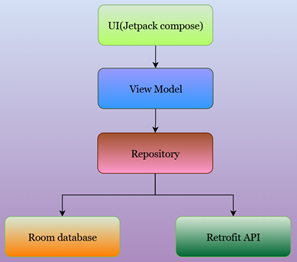
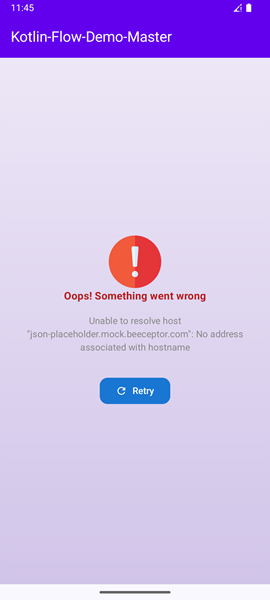

# Kotlin-Flow-Demo-Master

[](https://developer.android.com/topic/libraries/architecture/viewmodel)
[](https://kotlinlang.org/docs/flow.html)
[](https://developer.android.com/jetpack/guide)
[](https://dagger.dev/hilt/)
[](https://developer.android.com/training/data-storage/room)
[](https://square.github.io/retrofit/)
[](https://developer.android.com/jetpack/compose)


## 📌 Overview
This is a demo Android project showing **best practices for data loading** using:
- ViewModel
- Kotlin Flow
- Repository Pattern
- Hilt Dependency Injection
- Room Database
- Retrofit API
- Jetpack Compose UI

## 🚀 Usage
1. Clone the repository:
   ```bash
   git clone https://github.com/anilkumar2681/Kotlin-Flow-Demo-Master.git
   ```

2. Open in **Android Studio** (Arctic Fox or newer).

3. Run on emulator/device.

The app will fetch users from `https://json-placeholder.mock.beeceptor.com/users`, cache them into Room DB, and display them with Jetpack Compose.

## 🏗️ Architecture
```
UI (Jetpack Compose) <-> ViewModel <-> Repository <-> (Room DB + Retrofit API)
```



## 📸 Screenshots
| Loading State                  | Success State | Error State |
|--------------------------------|---------------|-------------|
|  |  |  |

## 🔑 Key Concepts
- `UiState` for handling **Loading/Success/Error**
- `StateFlow` in ViewModel for UI state exposure
- Repository pattern for clean separation
- Offline-first approach (cache → network)

--- 
Made with ❤️ using Kotlin + Jetpack Compose

## WhatsApp Channel
Get Kotlin & Android Jetpack Compose tips on `What's App` **Join My Channel** :
[📚 Kotlin & Android Learning📚](https://whatsapp.com/channel/0029VbBGTNr90x2umLoWKU3z)
